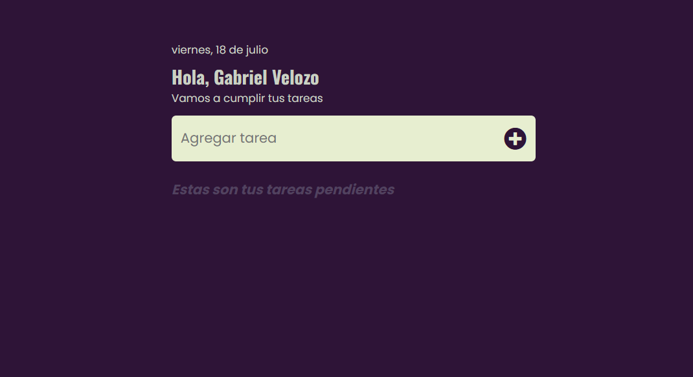
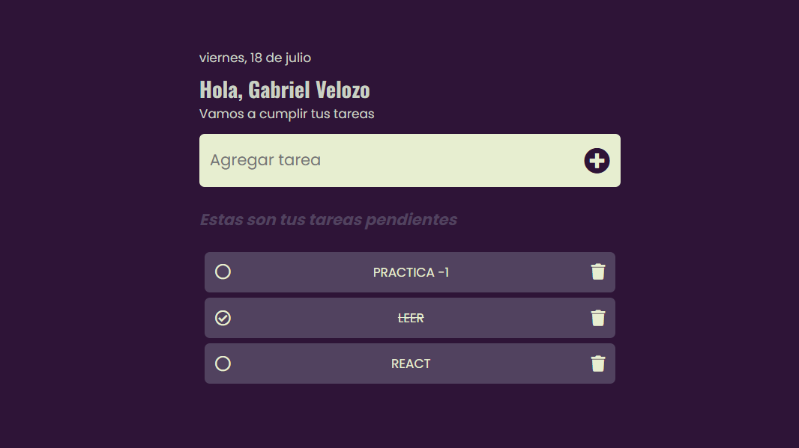

# ToDoList 📝

Una To-Do List es una aplicación sencilla pero poderosa para gestionar tareas diarias. Permite a los usuarios:

- Agregar, editar y eliminar tareas.
- Marcar tareas como completadas (con un checkbox o estilo tachado).
- Almacenamiento local (para que las tasks no desaparezcan al recargar).

---

## 🚀 Características

- 📃 Crear notas, tener un control actualizado.
- 💾 uso de Local Storage para guardar las tareas.
- ❌⛔ Eliminar, marcar la tarea realizada.

---

## 🛠️ Construido con

  

---

## 🌐 Live demo

🧷 [Ver TodoList..](https://helpful-cactus-360c68.netlify.app/)

---

## 📸 Vista previa

Aquí tienes un vistazo del TodoList :




---

## 📂 Estructura de carpetas

```
Text Typing/
│
├── index.html      # Main HTML file
├── css
    ├── style.css
├── js
    ├── app.js
└── image.png
└── image-1.png
```

---

## 🙋 Acerca de mi

- 🐤 [_Twitter_](https://x.com/Gabiitto_)
- 💼 [_LinkedIn_](https://www.linkedin.com/in/velozogabriel/)
- 📷 [_Instagram_](https://www.instagram.com/gabittovelozo/?hl=es)
- 😺 [_GitHub_](https://github.com/Gabrielvelozo)
